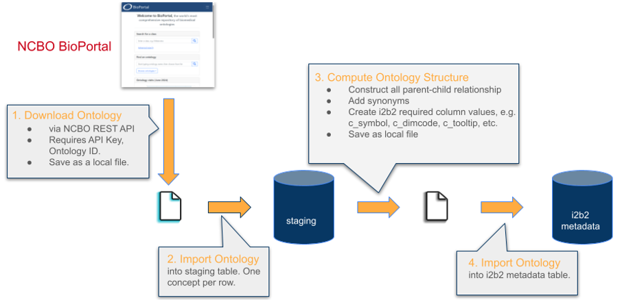

# NCBO_Extractor_2024

## Overview

NCBO_Extractor_2024 is the 2024 revival and refresh of Lori Phillips' [NCBO Extraction Tool Version 2.0, released in Feb. 2014](https://community.i2b2.org/wiki/display/NCBO/NCBO+Extraction+Tool+version+2.0).

This project includes the 3 Eclipse projects required to build and run the tool. Its JDBC driver for SQL Server has been updated. It also includes a few scripts to help users create database tables in SQL Server and import data into SQL Server tables. A user documentation details all the ins-and-outs of the tool. It also has a section to help developers set up an environment to run and test the code in Eclipse.

This tool enables i2b2 users to download bioportal ontologies and convert them into a format that can be directly inserted into i2b2's ontology tables. This makes it easy for any i2b2 instance to host any ontologies in bioportal.

This project has two executibles: ExtractAll and ProcessAll. The former downloads the speciied ontology from [bioportal.bioontology.org](https://bioportal.bioontology.org/) and writes them into a file. Users then ETL the file into SQLServer (or your favorite DB). The second executible reads from your DB tables and creates a second file, which can be ETL'ed into your target i2b2 instance to set up the ontology.

This workflow is illustrated in the following diagram:

Some caveats for this tool:

1. In order to run the tool to download ontologies from bioportal, you must have a valid bioportal apikey, which can be obtained by creating a login on [bioportal.bioontology.org](https://bioportal.bioontology.org/).
2. The tool can be run using JRE 8 or JRE 11. Newer JREs do not work due to the tool's reliance on older libraries.
3. The source code is set up to be easily imported into Eclipse. Documentation assumes developers are using Eclipse.
4. The code has been testd with SQL Server. Better support and documentation for Oracle and Posgres are forthcoming.

See <a href="documentation/release/">User Documentation</a> for more details.

## License
This software is released under the same license as i2b2: <a href="https://www.i2b2.org/software/i2b2_license.html">Mozilla Public License ("Software License") Version 2</a>

## Project status
This project is ongoing and is periodically updated.
